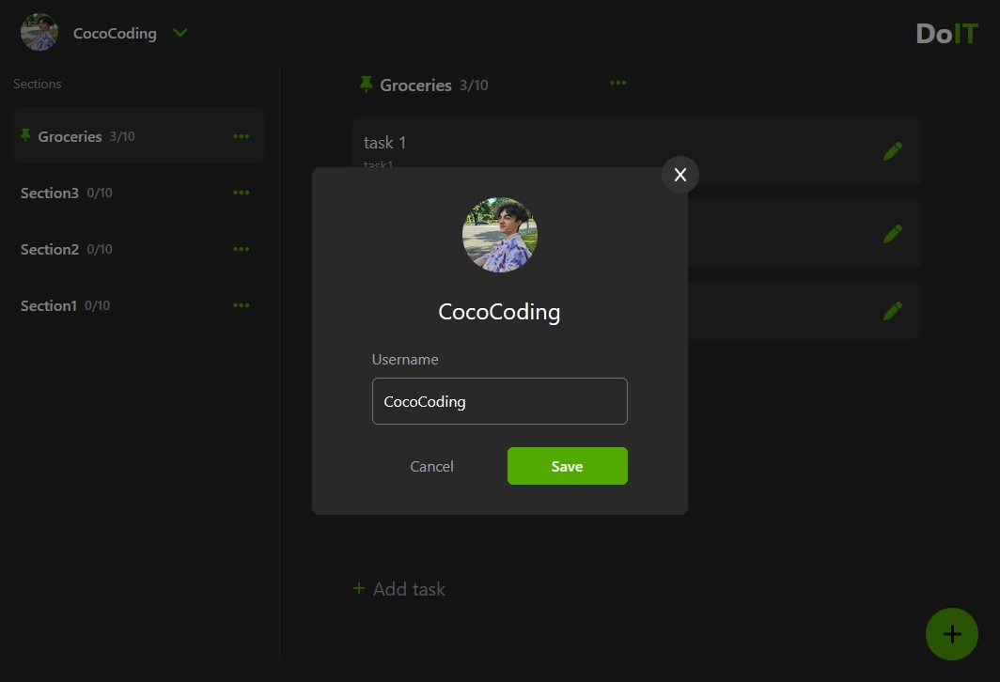

<h1 align="center"> 📝 DoIT</h1>

  
<i>An intuitive task manager built with <b>React, Tailwind CSS, and Firebase</b></i>.

  
  

<h2>🔥 Features</h2>
<ul>
  <li>⚙️ Create, edit, and delete sections and tasks.</li>
  <li>📌 Mark tasks and sections as important.</li>
  <li>🔥 Real-time sync with Firebase.</li>
  <li>👤 Google authentication via Firebase.</li>
  <li>🔧 Change the username of your account.</li>
</ul>

<h2>🛠️ Technologies Used</h2>
<ul>
  <li>
    <b>React.js: </b> For the user interface.
  </li>
  <li>
    <b>Tailwind CSS: </b> For a modern and responsive design.
  </li>
  <li>
    <b>Firebase: </b> For database and authentication.
  </li>
  <li>
    <b>React Router DOM: </b> For managing navigation and routing within the app.
  </li>
  <li>
    <b>Font Awsome</b> For icon implementation.
  </li>
</ul>

<h2>🚀 Installation & Setup</h2>
<ol>
  <li>
    <b>Clone the repository:</b>
      
    <pre><code>git clone https://github.com/your-username/todo-app.git</code></pre>
  </li>
  
  <li>
    <b>Navigate to the project directory:</b>
      
    <pre><code>cd .</code></pre>
  </li>

  <li>
    <b>Install dependencies:</b>
      
    <pre><code>npm install or npm i</code></pre>
  </li>

  <li>
    <b>Set up Firebase:</b>
     
    - Create a Firebase project in the <a href="https://console.firebase.google.com/"> Firebase Console</a>.
     
    - Go to <b>Project settings</b> → <b>General</b> → <b>Your apps</b>.
     
    - Copy the Firebase SDK config and replace the values in a new <code>.env.local</code> file.
      
    <b>Create a .env.local file in the root directory and add:</b>
      
    <pre><code>
VITE_FIREBASE_API_KEY=your_api_key
VITE_FIREBASE_AUTH_DOMAIN=your_auth_domain
VITE_FIREBASE_PROJECT_ID=your_project_id
VITE_FIREBASE_STORAGE_BUCKET=your_storage_bucket
VITE_FIREBASE_MESSAGING_SENDER_ID=your_sender_id
VITE_FIREBASE_APP_ID=your_app_id
    </code></pre>
  </li>

  <li>
    <b>Run the app:</b>
      
    <pre><code>npm run dev</code></pre>
  </li>
</ol>

<h2>Reason?</h2>

Just wanted to develop a mini-version of the Todoist app cause why not?🙃

<h2>📷 More Screenshots</h2>

  
  
  

